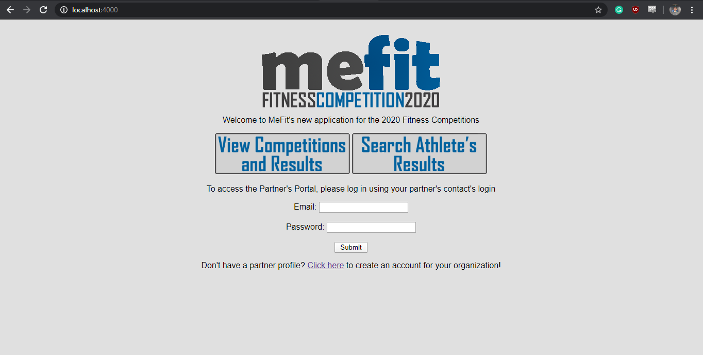

# Final Project - CSI2532

Sean Stilwell - 300053246

This repository contains all files and documentation for the final deliverables (3 and 4) of the final project for CSI2532 (Databases I) in Winter 2020. Here is a breakdown of eachdeliverable requirements and where they can be found for evaluation:

### Deliverable 3 (12.5%) The Application

| Mark        | Description                                                         | Information                                               |
| :---        | :---                                                                | :---                                                      |
| 2.0         | ER model                                                            | See below, in ER Model + Explanation                      |
| 2.0         | Relational model / SQL Schema                                       | See below, in Relational Model / SQL Schema + Explanation |
| 2.0         | SQL seed / examples to INSERT, UPDATE, SELECT, and DELETE data.     | See databases folder                                      |
| 2.0         | Application                                                         | See below, in Application + Instructions, and video demo  |
| 1.0         | README.md contains all required information                         | See subsections below                                     |
| 1.0         | Git usage (commit messages, all students involved)                  | Group of 1, see commits for messages.                     |

### Video Demo of the Application

Although Deliverable 4 was cancelled, I created this video as a demonstration of all the functionality required. This is useful for demonstrating how to achieve all of the functionality outlined in the project description.

### ER Model + Explanation

I decided to use LucidChart to create my ER diagram for this project. [Link to View-Only model](https://www.lucidchart.com/invitations/accept/a52b42f4-656f-4581-8ae8-5447351d720f). A free account is needed to access the service. I used my uOttawa Google Account to access it.

For this deliverable, I added the events entity. An event is associated with just one competition, but a competition has numerous events. I also added results, which contains the results attained by a registered athlete in each event. I also added the partners entity, which can manage multiple competitions (although each competition has only one partner). There is also a contact person entity for both the partners and competitions.

### Relational Model / SQL Schema + Explanation

I also used LucidChart to create the relational model for this project. [Link to View-Only model](https://www.lucidchart.com/invitations/accept/a52b42f4-656f-4581-8ae8-5447351d720f). A free account is needed to access the service. I used my uOttawa Google Account to access it.

As explained above, I added several entities to introduce partners, results, and events to the system. Events are associated with competitions, and each events has a series of results that are linked to registrations of athletes. There are also now partners, which can have multiple events, as well as contact people for the partners and competitions.

My SQL schema can be found [here](https://github.com/professor-forward/projet-sean_stilwell_csi2532/blob/master/database/1_schema.sql) and the migrations can be found [here](https://github.com/professor-forward/projet-sean_stilwell_csi2532/tree/master/database/migrations).

### Application + Instructions

Video demo of the application and functionality: <a href="https://youtu.be/QqUx5usQNmk" target="_blank">Here</a>

For my application, I chose to continue develping the PHP application as recommended by Professor Forward for students who haven't had prior experience with databases. My database was titled "leaderboard" and used the superuser "postgres" with password "password". 

It can be run by first running the **database/1_schema.sql** to create the relations, as well as **database/2_insert_data.sql** to populate them with data. After that, the php app can be run using *(cd public && php -S localhost:4000)* in the console, and then visiting http://localhost:4000/

When run correctly, this is what should appear:

**Some seeded partner accounts for testing**

Email: *jessiematthews@uottawa.ca* Password: *password123* **recommended - contains the most seeded data**

Email: *patrickjones@ottawa.ca* Password: *Password1*

Email: *jcartier@gatineau.qc.ca* Password: *password*

### Example Queries

Sample queries for this deliverable can be found in the databases folder. The titles identify their purpose (such as insert_data)

I tested these queries using the website provided by Professor Forward [here](https://db-book.com/db7/university-lab-dir/sqljs.html) initially, however due to differences between Postgresql and Sqlite, I've been doing it using the console and Pgadmin instead.